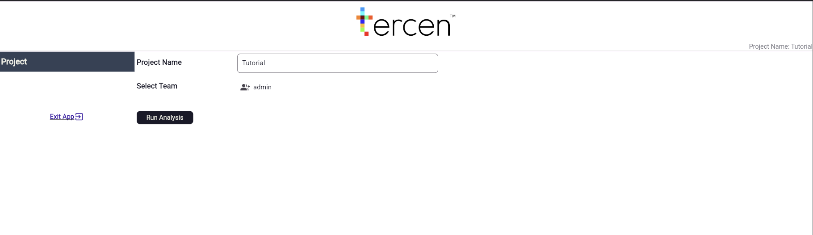

## WebApp Creation Tutorial

WebApp are bespoke user interfaces built on top of Tercen's flexible server capabilities. These UI's provide a way to group or grant easy access to common use cases, increasing productivity and reducing user training time.

This tutorial will guide in the creation of your first WebApp: the **UMAP report app**. We will start by covering the use case, briefly how this is achieved typically in Tercen and how the WebApp can change the way the user interacts with Tercen.

### 1. UMAP Report App

Our tutorial use case has four steps:

1. Upload some data
2. Perform cluster analysis using UMAP
3. Check the output 
4. Download a PDF with images of interest

You can download the sample data used in the tutorial from this repository [github.com/data].

##### 1.1. Sample Data Description

TODO

### 2. The Standard Method

If you already know how to do all steps in Tercen, you can skip straight to section 3 [REF], otherwise let's see how to do this. You can also refer to the Developer's Guide [REF] for a detailed view on how to take advantage of Tercen's full functionality.

##### 2.1. Project Setup

We start by creating an empty project and uploading the [DATA] file as a table to it. 

Then, we create a workflow from the WEBAPP EXAMPLE template. This workflow has 4 steps:

1. The table step to which we will link our sample data
2. The UMAP steps, which runs the UMAP operator on the data
3. & 4. Are visualizations of the resulting UMAP. We will use them to inspect and download images of interest.

[IMG_01 - Workflow]

##### 2.1. Running the Workflow

Now we select the TABLE Step and press run. A prompt appears asking us to select a file. We choose the file we uplaoded earlier and press Next. Although not mandatory, it is better to save our workflow now, in case we accidentally reload the page.

Next, we double click on the UMAP step to build our projection.

[DESCRIBE PROJECTION]

Once we finish setting up our projection we can run the UMAP actually calculation by pressing on the run button. After a few moments, the screen will update and show us a table with the calculated UMAP projections.

DESCRIBE PLOTS

##### 2.2. Saving the Images

TODO

##### 2.3. Scaling

If we want to keep every workflow executed -- and the generated images -- we would need to execute these steps for every new dataset we want to analyze. That is fine if we don't do that very often. In a scenario of multiple runs per day, or multiple users, the overhead can become noticeable.

One solution to this overhead is to do as much as possible inside the operator (see HERE about developing your own operators). Fore more complex analyses, this can make workflows harder to understand and audit in the long run.

A second solution is to develop an UI handles a lot of functionality "behid the scenes", leaving the users free to focus on the analyses and results. That is exactly what WebApps do.


### 3. Developing a WebApp

This is the main section in our tutorial. Here, we will learn how to code a custom UI to run the steps described in section 2.

**NOTE:** This tutorial assumes that the Flutter SDK is correctly installed.

**NOTE 2:** We use VS Code as the development environment in this tutorial. 

##### 3.1. Repository Setup

The first step is to create a Github repository that will contain our WebApp code. Tercen provides a template for that. Select the <code>tercen/webapp_template</code> template, set the new repository to public and click on <code>Create repository</code>.

**NOTE:** Don't forget to end your repository name with **_operator**, otherwise it will not appear in the list of Aps to run.


<p>
</br>
<em>Repository creation. Select <code>tercen/webapp_template</code> as the template (1). Although private repositories are supported, for the sake of simplicity, we will create a public one for this tutorial (2).</em>
</p>


Next, clone the project and in its root project run <code>flutter pub get</code> to ensure that all dependencies are satisfied.

###### 3.1.1. Overview of the WebApp project files

The project comes with a number of folders and files that we will become familiar as the tutorial goes on. For now, it suffices to know that we will create our screens under the <code>lib/screens</code> folder and register them in the <code>main.dart</code> file. 

<p>
</br>
<em>File structure of a recently created WebApp project.</em>
</p>

###### 3.1.2. Tercen Components

Tercen provides a [webapp development library](https://github.com/tercen/webapp_lib). It contains a number of functions to interact with Workflows, Projects and Users. It also wraps commonly used Widget in what we call **Components**.

**Components** have two main roles:
1. Provide reusable code so it becomes easy to add Widgets like text input or tables to your screens.

2. Integrates these Widgets with the overall WebApp architecture, automatically handling layout placement, state saving and providing a framework for interaction with the data layer.


##### 3.2. Running the WebApp

Before developing our code, let's first see how do we run our WebApp. 

###### 3.2.1 Running from the Library

The standard method of running a WebApp is by pressing the **Run** button after installing the WebApp in the library. Before doing that, however, we need to build the project.

In the root folder of the project, run the <code>flutter build web</code> command. One this is done, go into the **build/web** folder and open the <code>index.html</code>. Remove the <code>\<base href="/"\></code> line. This line interferes with how Tercen serves up WebApp pages, so if it is not removed, your WebApp will not be displayed.

<p>
</br>
<em>Line to be removed before commiting the build to Github.</em>
</p>

Push the build changes to Github and install the WebApp as you would install any operator (REF To dev guide).  

In the root of your project screen, click on the <code>Run</code> button and select your WebApp on the list that will appear and press Ok.

<p>
</br>
<em>Selecting your WebApp.</em>
</p>

You will then be greeted by the default WebApp page.

<p>
</br>
<em>Your first WebApp.</em>
</p>

The WebApp has a single screen showing the Project name and the user team. 

###### 3.2.1 Running from VS Code


##### 3.3. The Project Screen

Before coding our own screen, let's take some time to look in detail what is in a WebApp screen. If you prefer a more hands-on approach, you can go straight to chapter 4 to start coding your screen and then come back here for the details. Otherwise, open the <code>lib/screens/project_screen.dart</code> file.

You will notice that that a screen is a <code>StatefulWidget</code> with two <code>mixin</code> classes added. We will go over each over those.

###### 3.3.1 The Screen Widget

The screen widget is where we add our components reside and will control the interaction with the user. It has access to the model functions, so components can access data without being concerned with data logic. 


```dart
class ProjectScreen extends StatefulWidget {
final WebAppData modelLayer;
const ProjectScreen(this.modelLayer, {super.key});

@override
State<ProjectScreen> createState() => _ProjectScreenState();
}
``` 

The <code>ProjectScreen</code> has nothing special for a <code>StatefulWidget</code> with the exception of the line **<code>final WebAppData modelLayer;</code>**. <code>WebAppData</code> is where we are going to store our model logic. We will not look into that just yet, but just know it is there.

```dart
class _ProjectScreenState extends State<ProjectScreen>
    with ScreenBase, ProgressDialog {
```

Our <code>_ProjectScreenState</code> has two <code>mixin</code> classes added. <code>ProgressDialog</code> provide utility functions to display modal messages to users, such as progress messages during a lengthy computation. <code>ScreenBase</code> handles all the heavy work in correctly positioning components and saving calling the necessary functions to save view states across sesessions. To handle all these functions, we need to overwrite a number of functions.

Let's look at a summarized view of the overriden functions in the <code>ProjectScreen</code>.

```dart
  @override
  String getScreenId() {
    return "ProjectScreen";
  }

  @override
  void dispose() {
    super.dispose();
    disposeScreen();
  }

  @override
  void refresh() {
    setState(() {});
  }

    @override
  void initState() {
    super.initState();

    // HERE We add the components

    initScreen(widget.modelLayer as WebAppDataBase);
  }

  @override
  Widget build(BuildContext context) {
    return buildComponents(context);
  }
```

The <code>dispose()</code> and <code>refresh()</code> handle any specific cleanup and screen refresh, respectively. They will generally be exactly the same as in this screen. The <code>getScreenId()</code> is similarly straightforward and we only need to return the name of the screen. Tercen uses this value to save component states across sessions and avoid name clashes across screens.

If we are not fetching any data from the model layer, we simply need to call <code>buildComponents</code> from the <code>ScreenBase</code> in the <code>build(...)</code> method. Otherwise, we can wrap the <code>buildComponents</code> call inside a <code>FutureBuilder</code>.

Finally, the <code>initState()</code> is where we will add all the components to the screen. We will describe the details in the next section, but it is **mandatory to follow a certain order** in coding this function.

1. <code>super.initState()</code>
2. All your components
3. <code>initScreen(widget.modelLayer as WebAppDataBase);</code> as **the last call**

The <code>initScreen</code> call goes over all the components setting their initial values, so any component added after this call will not be properly initialized.

With this overview of what is in a WebApp screen, we are ready to develop our first screen.

##### 3.4. The Upload Data Screen

In the upload data screen, we want to select one or more CSV files, upload them to the project and then run the UMAP analyses on them.

###### 3.4.1. Adding a screen to the WebApp

Add a new file called <code>upload_data_screen.dart</code> under the lib/screens folder. The base code for our screen widget is displayed below.

```dart
import 'package:flutter/material.dart';

import 'package:webapp_components/screens/screen_base.dart';
import 'package:webapp_model/id_element.dart';
import 'package:webapp_model/webapp_data_base.dart';
import 'package:webapp_template/webapp_data.dart';
import 'package:webapp_ui_commons/mixin/progress_log.dart';

class UploadDataScreen extends StatefulWidget {
  final WebAppData modelLayer;
  const UploadDataScreen(this.modelLayer, {super.key});

  @override
  State<UploadDataScreen> createState() => _UploadDataScreenState();
}

class _UploadDataScreenState extends State<UploadDataScreen>
    with ScreenBase, ProgressDialog {
  @override
  String getScreenId() {
    return "UploadDataScreen";
  }

  @override
  void dispose() {
    super.dispose();
    disposeScreen();
  }

  @override
  void refresh() {
    setState(() {});
  }

  @override
  void initState() {
    super.initState();

    initScreen(widget.modelLayer as WebAppDataBase);
  }

  @override
  Widget build(BuildContext context) {
    return buildComponents(context);
  }
}

```

Right now, we would not be able to reach our screen, so we need to add it to the left-hand menu of our WebApp. To do that, open the <code>lib/main.dart</code> and edit the <code>initState</code> function. 

We want to add a new navigation page to the web app, so we update

```dart
app.addNavigationPage(
    "Project", ProjectScreen(appData, key: app.getKey("Project")));
```

to

```dart
app.addNavigationPage(
    "Project", ProjectScreen(appData, key: app.getKey("Project")));

app.addNavigationPage(
    "Upload Data", UploadDataScreen(appData, key: app.getKey("UploadData")));
```

and that's it. If you redeploy your project now, you will see that you have two entries in the left-hand menu and selecting Data Upload will lead you to an empty screen. We will change that in a moment.

<p>
</br>
<em>A new but empty screen.</em>
</p>

###### 3.4.2. Adding the Data Upload Component

###### 3.3.1. Linking a WebApp to a Workflow Template

###### 3.3.2. Exposing Workflow Settings

##### 3.4. The Report Screen

###### 3.4.1. Mapping Workflow Steps


